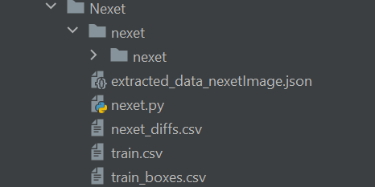

# NEXET dataset
Here you can find all the files needed to extract information from the NEXZT dataset.

## Warning
This file do not contain the data of the dataset due to stockage issues.
If you decide to use another file structure you may have to change all the paths in the different scripts.

## How to extract data
1. Download the data from https://www.kaggle.com/solesensei/nexet-original.
2. You should have the following structure:  

3. Launch the nexet.py script.
4. You now have a file extracted_data_nexetImage.json in the ./Nexet folder.

