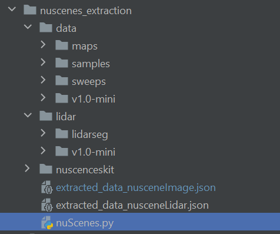

# nuScenes dataset
Here you can find all the files needed to extract information from the nuScenes dataset.

## Warning
This file do not contain the data of the dataset due to stockage issues.
If you decide to use another file structure you may have to change all the paths in the different scripts.

## How to extract data
### Initialization
1. Download the nuscenes-devkit and rename it nusceneskit.
2. Download the data from the nuscenes website.
3. You should have the following structure:  

4. Launch the export_2D_annotations_as_json.py file located in the ./nusceneskit/pythonsdk/nuscenes/scripts/ folder (you may have to modify some paths in this script line 197).
5. You have now a new file named image_annotations.json.

### Extract data by image
1. Open the nuscenes.py script.
2. Line 125 please call extract_image_annotation().
3. Launch the nuscenes.py script.
4. You now have a file extracted_data_nuscene_image.json in the ./nuscenes_extraction folder.

### Extract data by image
1. Open the nuscenes.py script.
2. Line 125 please call extract_image_annotation().
3. Launch the nuscenes.py script.
4. You now have a file extracted_data_nuscene_image.json in the ./nuscenes_extraction folder.

### Extract data by image without bonding boxes
1. Open the nuscenes.py script.
2. Line 125 please call extract_image_annotation_only().
3. Launch the nuscenes.py script.
4. You now have a file extracted_data_nuscene_image_only.json in the ./nuscenes_extraction folder.

### Extract data by lidar
1. Open the nuscenes.py script.
2. Line 125 please call extract_lidar_annotation.
3. Launch the nuscenes.py script.
4. You now have a file extracted_data_nuscene_lidar.json in the ./nuscenes_extraction folder.

### Extract data by scenes
1. Open the nuscenes.py script.
2. Line 125 please call extract_scene_annotations().
3. Launch the nuscenes.py script.
4. You now have a file extracted_scene_annotation.json in the ./nuscenes_extraction folder.

